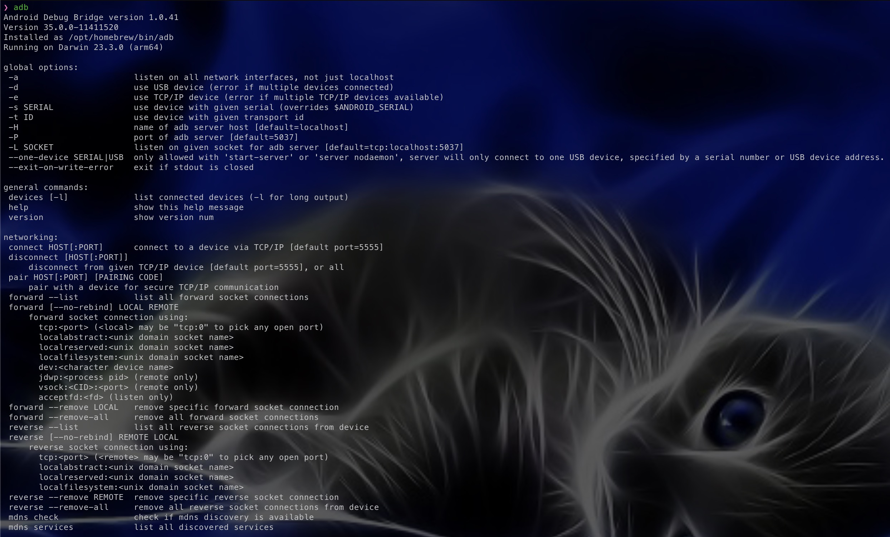

# Tools: Android Debug Bridge

Our next, and arguably one of the most useful tools, is the Android Debug Bridge (ADB). ADB is a tool that comes directly from Android itself. Designed for developers, ADB gives us a simple interface for interacting with our Android phone. While the tool is very powerful, and has many capabilities, the 3 we are most interested in are the shell, push/pull, and logcat. The shell command will let us search the file system. The push/pull commands will let us download files to and from the device, and the logcat command will allow us to see debug logs from the phone easily. As you can guess a very powerful tool when working with Android applications.

So how do we get started? Let's find out together and download ADB for ourselves.

If you are downloading ADB, on the Linux VM we setup in a previous section this process is very easy. If you are using a different OS, the process is still rather straightforward. However, for this course, we will only be installing ADB on the Linux VM. To do this, simply run the following command "**sudo apt install adb**". This will use Ubuntu's built-in package manager to install ADB and set everything up for you. Once that is done, you should now have ADB installed. Run "\textbf{adb}" if you see the following output ADB installed with no issues.

<figure><figcaption></figcaption></figure>


If you are installing on a different OS, check out these two links for install instructions.

[Linux Installation](https://www.tecmint.com/install-android-debug-bridge-linux/)

[Windows and MacOS Installation](https://www.xda-developers.com/install-adb-windows-macos-linux/)


Congratulations, you have just successfully installed ADB and can now being interacting with Android phones. Join me in the next section, as we install our final main tool for this course Ghidra.
