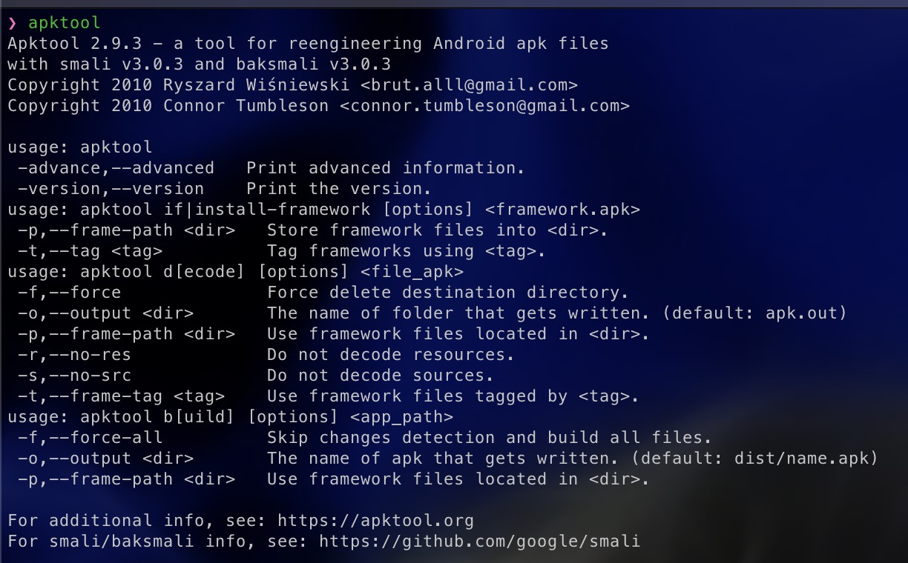

---
layout:
  title:
    visible: true
  description:
    visible: false
  tableOfContents:
    visible: true
  outline:
    visible: true
  pagination:
    visible: true
---

# Tools: APKTool

So we have a Linux environment and know how to use VIM, but what else do we need to be effective Android reverse engineers? To answer that question, I will first introduce you to APKTool. Created by iBotPeaches, APKTool is a lightweight but powerful Android reverse engineering tool designed for the command line. While APKTool is capable of many powerful things such as disassembling, assembling, and analyzing Android apps known as Android Packages or APKs for short, right now we will only install APKTool. Later on in this series, we will begin to dive into APKTool and all that it is capable of.

APKTool works on Linux, Windows, and Mac, but for this tutorial we will install it on Linux. However, installation instructions for all 3 OSes can be found [here](https://apktool.org/docs/install).

The first thing that we have to install is the APKTool wrapper script, which can be found at the link above. We can install it using the following commands:


```bash
cd ~ mkdir Tools 
cd Tools 
mkdir APKTool 
cd APKTool 
wget https://raw.githubusercontent.com/iBotPeaches/Apktool/master/scripts/linux/apktool
```


These commands will create a directory in our home directory called **Tools**. This is something that I like to do when installing custom tools that I want access to system-wide.

The next thing that we need to do is install APKTool itself. For that, download the latest version [here](https://bitbucket.org/iBotPeaches/apktool/downloads/). When downloading the file, make sure to place it in the newly created **Tools/APKTools/**. Once that is done, run the following commands to finish the installation.

```bash
mv apktool_2.9.3.jar apktool.jar 
sudo chmod +x apktool.jar 
sudo chmod +x apktool 
sudo cp apktool.jar /usr/local/bin/ 
sudo cp apktool /usr/local/bin/ apktool
```

If everything was done correctly, you should see the following. If you do, congrats! You have officially installed APKTool and are one step closer to becoming an Android reverse engineer.

<figure><figcaption></figcaption></figure>

Now that we have APKTool installed, we are one step closer to having a proper analysis environment for doing Android reverse engineering.

Join me in the next installment, where we will look at Jadx, a Java decompilation tool, and walk through how to install it.
