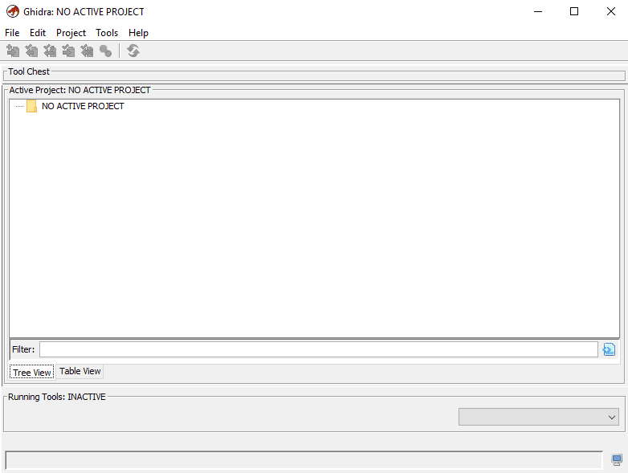

# Tools: Ghidra

Our last, and arguably most powerful tool is Ghidra. Created by the National Security Agency (NSA) Ghidra is a reverse engineering tool and framework designed for working with native code. With many powerful capabilities, such as the ability to decompile almost any architecture, emulation, disassembly, and debugging, Ghidra can mostly do it all. For this reason, Ghidra is extremely useful for us to know as reverse engineers. Not only can it help us with Android reverse engineering, but it can help with other forms of reverse engineering we might explore in the future. With that being said, let us look into how to install this amazing tool.

The first step in installing Ghidra is installing the latest Java JDK version. To do this on the Linux VM we installed earlier, run the following command, "**sudo apt install openjdk-17-jdk -y**". This command will install the Java JDK for you and take care of setting that up, so we don't have to. Once that is done, we have to install Ghidra itself. To do this, go to the following [GitHub page](https://github.com/NationalSecurityAgency/ghidra/releases) and download the most recent zip file. Once the file has been downloaded, unzip the file, and and navigate to that directory. Next, run the following command, **./ghidraRun**. If everything is installed correctly, you should see something similar to the image below.

<figure><figcaption></figcaption></figure>

With that, you have successfully installed Ghidra the last tool in this chapter. With Ghidra we can do many cool things such as emulation, decompilation, disassembly, and much more. However, we will get there much later. For now, let us continue learning the many great things there are to know about Android reverse engineering. Continue along, as in the next section, we will begin to look into Android and its security systems.
