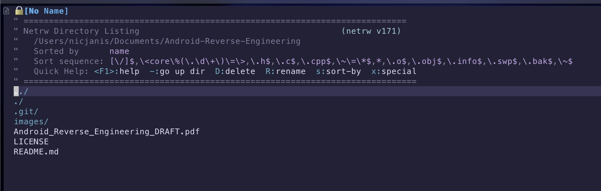

# Tools: VIM

Now that we have a working Linux setup, it's best that we install some kind of text editor. For this tutorial, we will be using VI Improved, more commonly known as VIM.

VIM is a text editor that works in the command line. VIM is what is known as a modal editor. This means that you have different modes of operation and, depending on your mode, you can do different things. This may sound daunting, but we can do it together. And yes, we will be answering the age old question of "How do you quit VIM?"

At the end of this section, you will be able to not only quit VIM, but also use a text editor available to any and every UNIX-based system. This means that if you are on any UNIX computer, Linux, Android, Mac, etc., you will be able to work with and edit files. This is our true reason for learning to use VIM. Because who wants to download a file from a phone, modify it, and then push it back to the phone? If you know VIM, you don't have to.

And I know, I know, VIM may seem weird but it's the fastest way to edit text on any UNIX machine. And to paraphrase a friend of mine, "It beats the caveman way of doing it. Using the echo command to edit files."

<figure><figcaption></figcaption></figure>

So now that I've hopefully got you hooked on VIM, and you are ready to ask "how do we get it?". Well in some cases, you might already have it installed. If you open a terminal, and type "`vim .`", if VIM is installed it will open and put you into NetRW, which will let you browse your files. However, if this command fails, let's install VIM so we can get started. To do this, use whatever package manager is on your operating system. For our Linux VM, the command will be **sudo apt install vim -y**. This command will install VIM for us so that we can get started.

Once VIM is installed, run the same command from earlier to ensure that VIM is installed correctly.

<figure><figcaption></figcaption></figure>

Now to answer the age old question of, "How do I exit VIM?"

To answer this question, first hit the \textbf{escape} key which will enter you into \textbf{Normal mode}. Once you are in normal mode, press the following keys in order, \textbf{:q}. Now you too know the answer to the mystical secret that is closing VIM.

So let's break down what that command means.&#x20;

1. **:** - The colon enters us into command mode, where we can enter commands to execute.&#x20;
2. **q** - This is the quit command, so we can quit the current VIM instance.&#x20;

Now that you know how to close files with VIM, let's learn how to edit some files. To open a file, run the following command `vim /.vimrc`. This will create a new file called **.vim** in the directory. Once this file is open, press the **i** key, this will enter you into insert mode. This will allow you to enter text. Type the following lines into your file:

```bash
set number 
set smartindent 
set tabstop=4 set 
shiftwidth=4 set expandtab
```

Then press "**escape**" to enter back into normal mode. Then press **:wq** to run the write command (**w**) and then the quit command (**q**). This will save and close your file.

Congrats! You have officially just created and edited your first file with VIM.

The file you just created will help format anything you write in order to make everything in the tutorial look more uniform.

Lastly, I will leave you with some of the most common commands you will use when using VIM.


**j or down-arrow** \[move cursor down one line]

**k or up-arrow** \[move cursor up one line]

**h or left-arrow** \[move cursor left one character]

**l or right-arrow** \[move cursor right one character]

**0** \[move cursor to the start of the current line]

**$** \[move cursor to the end of the current line]

**b** \[move cursor back to the beginning of preceding word]

**dd** \[deletes the line the cursor is on]

**D** \[deletes from the cursor position to the end of the line]

**yy** \[copies the current line]

**p** \[puts the copied text after the cursor]

**u** \[undo the last change to the file]

**:w** \[save file]

**:wq** \[save file and exit text editor]

**:q!** \[quit text editor and do not save any changes]


With this, you can now go read and modify text on any UNIX-based system no matter how big or small the system is. Plus, you can also say you know the answer to the question of, "How does one exit VIM?"

Join me in the next section where we continue our journey to set up our analysis environment by downloading tools. The next tool on our list will be APKTool, a small but powerful tool in any Android Reverse Engineer's toolkit.
